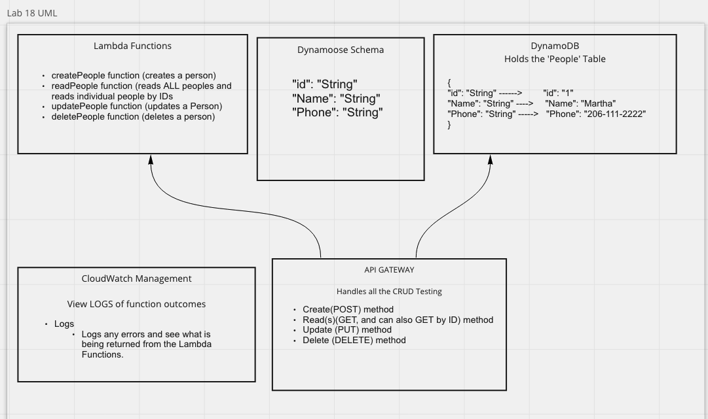
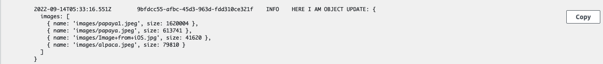

# image-lambda

## Lab 17 
AWS Lambda allows writing code that is triggered in the cloud, without thinking about maintaining servers. We’ll use it today to automatically run some processing on image files after they’re uploaded to an S3 Bucket

## Lab 18
Create a single resource REST API using a domain model of your choosing, constructed using AWS Cloud Services

- Database: DynamoDB
  - 1 Table required
- Routing: API Gateway
  - POST
/people - Given a JSON body, inserts a record into the database
  - returns an object representing one record, by its id (##)
- GET
  - /people - returns an array of objects representing the records in the database
  - /people/## - returns an object representing one record, by its id (##)
- PUT
  - /people/## - Given a JSON body and an ID (##), updates a record in the database
  - returns an object representing one record, by its id (##)
- DELETE
  - /people/## - Given an id (##) removes the matching record from the database
  - returns an empty object

- CRUD Operation Handlers: Lambda Functions

## Feature Tasks Lab 17

- Create an S3 Bucket with “open” read permissions, so that anyone can see the images/files in their browser
- A user should be able to upload an image at any size, and update a dictionary of all images that have been uploaded so far
- When an image is uploaded to your S3 bucket, it should trigger a Lambda function which must:
  - Download a file called “images.json” from the S3 Bucket if it exists
  - The images.json should be an array of objects, each representing an image. Create an empty array if this file is not present
  - Create a metadata object describing the image
    - Name, Size, Type, etc.
  - Append the data for this image to the array
    - Note: If the image is a duplicate name, update the object in the array, don’t just add it
- Upload the images.json file back to the S3 bucket

# PR

- <https://github.com/Marthaquinram/image-lambda/pull/1>
- <https://github.com/Marthaquinram/image-lambda/pull/3>

# UML 

# Documentation
- for my lambda, I created an S3 bucket to upload photos to, and then it triggers the lambda function that was created via lambda.
- Lambda fires off the function that creates a an image json file if theres none that exists.
- if an image DOES exists && theres an image json file, then itll add to that existing image json file.
- I was having issues at first with it creating mulitple image.json files and it was due to having lots of typos in my code.

# Lambda Link
- <https://photos-buckets.s3.us-west-2.amazonaws.com/images.json>

- Lambda JSON Log:
 

Collaborators:
- Danny C. , Sarah T. , Jim D. 
